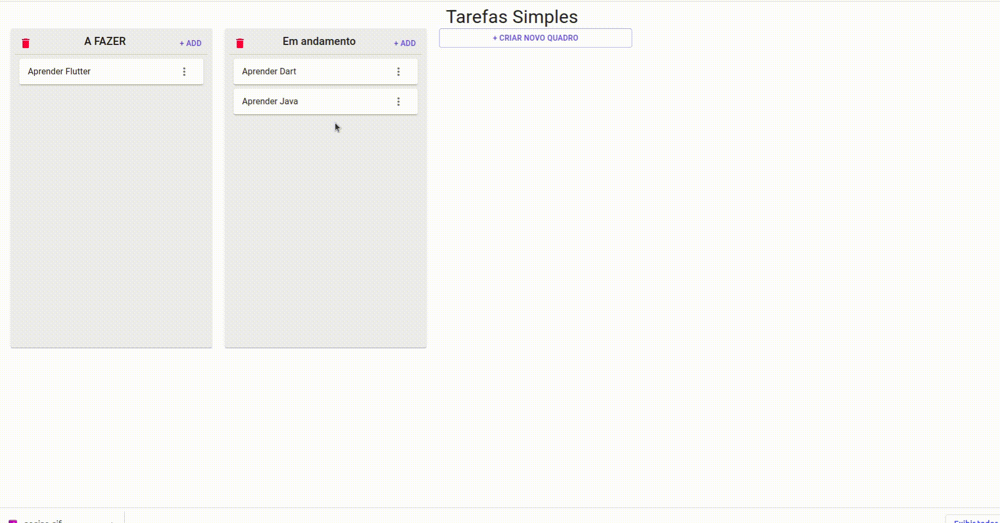

### Tarefas Simples

Este projeto tem como objetivo permitir ao usuário criar tarefas simples, com movimentação entre quadros que também podem ser criados.



#### Como implementar

Basta copiar os arquivos da pasta /build para o seu servidor.

#### Linguagens, libs e tecnologias usadas

O Tarefas Simples foi desenvolvido fazendo uso do React e das seguintes libs.

- Material-UI
- React Beautiful DND
- UUID
- react-use
- is-hotkey
- react
- react-redux

#### Como posso contruir ?

Caso você deseje contribuir de alguma forma para a melhoria do projeto basta clona-lo para a sua maquina, depois instalar as dependencias.

_Dentro do diretório do projeto digite_

```
yarn install
```

E então inicialize o projeto

```
yarn start
```

Faça as mudanças e me envie, estarei feliz em receber as melhorias afim de torna-lo um projeto melhor :)
